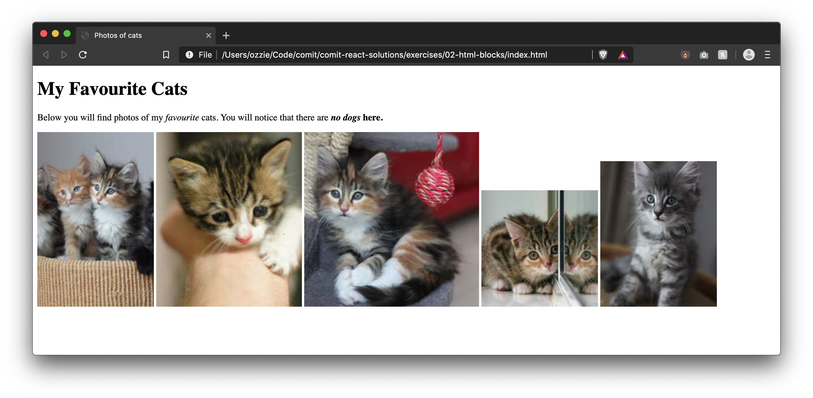

# Lesson 02 - HTML Blocks

Did you do the bonus for exercise 1? Just incase you didn't, here's what it would have looked like:


Notice how the paragraph went underneath the heading and not beside it? That's because HTML elements have a concept called `blocks`. An element is either `block` or `inline` (more on this later when we get to CSS).

By default:

- `block` elements take up the entire width of their container, forcing subsequent elements to go below them
- `inline` elements take up as much space as their contents and allow elements to sit to the left and right of them

Both the `h1` and `p` tags are examples of `block` elements, they will push whatever comes after them underneath them.

Let's introduce a few `inline` elements and see how they flow.

## Text Modifiers

We can give plain text some modifications using certain elements:

- `<strong>` - **bolds** any text inside
- `<em>` - puts _emphasis_ on any text inside (italics)
- `<sub>` - subscripts any text
- `<sup>` - superscripts any text

```html
<p>Example math 10<sup>4</sup></p>
<p>Example Footnote<sub>3</sub></p>
<p><strong>Notice me</strong></p>
<p><em>Implying something</em></p>
<p>
  <strong><em>Can be combined</em></strong>
</p>
```

You'll notice that it just gets rendered all in the same line. That's because like these text modifiers, plain text is also considered inline.

## Images

You can display an image in a webpage by using the `img` tag. The image tag is **self closing**, `` **not** `</img>`.

```html

```

**Required Attributes**

- `src` - Refers to where the file is located
- `alt` - Text that is provided to screen readers and renders on the page if the image fails to load. Should describe the image

# Exercise Instructions

1. Create an `index.html` file here
2. Give the page a title "Photos of cats"
3. Add a header title "My Favourite Cats"
4. Add a paragraph below to match the formatting (without css)

> "Below you will find photos of my _favourite_ cats. You will notice that there are **_no dogs_** here."

5. Place 5 photos of cats from [this website](https://placekitten.com/) underneath the paragraph
   - hint: the cat photo URL's are formatted like: `http://placekitten.com/width/height`. Swap out the width and height for a number, e.g. `http://placekitten.com/200/300`
6. Use a different width and height for each photo (specified using the url from above) to get a different cat for each image

# Exercise Result



# Further Reading

- [Full list of inline elements on MDN](https://developer.mozilla.org/en-US/docs/Web/HTML/Inline_elements#Elements)
- [Full list of block elements on MDN](https://developer.mozilla.org/en-US/docs/Web/HTML/Block-level_elements#Elements)
