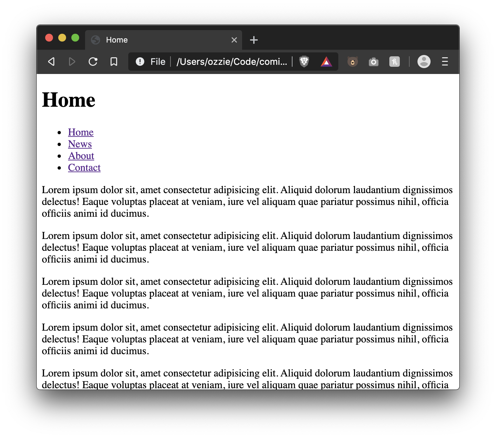
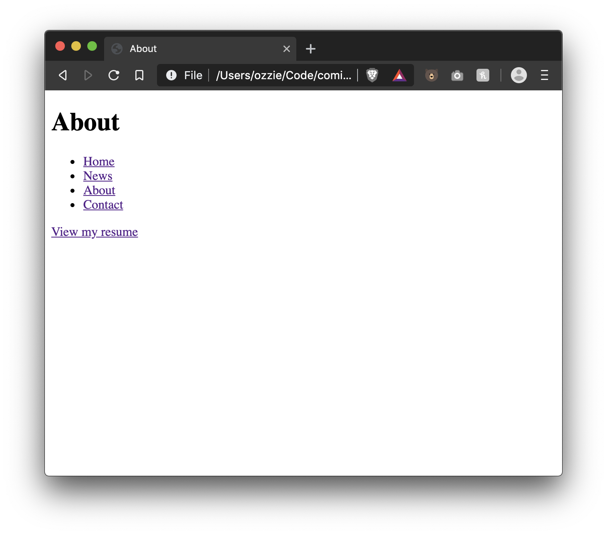
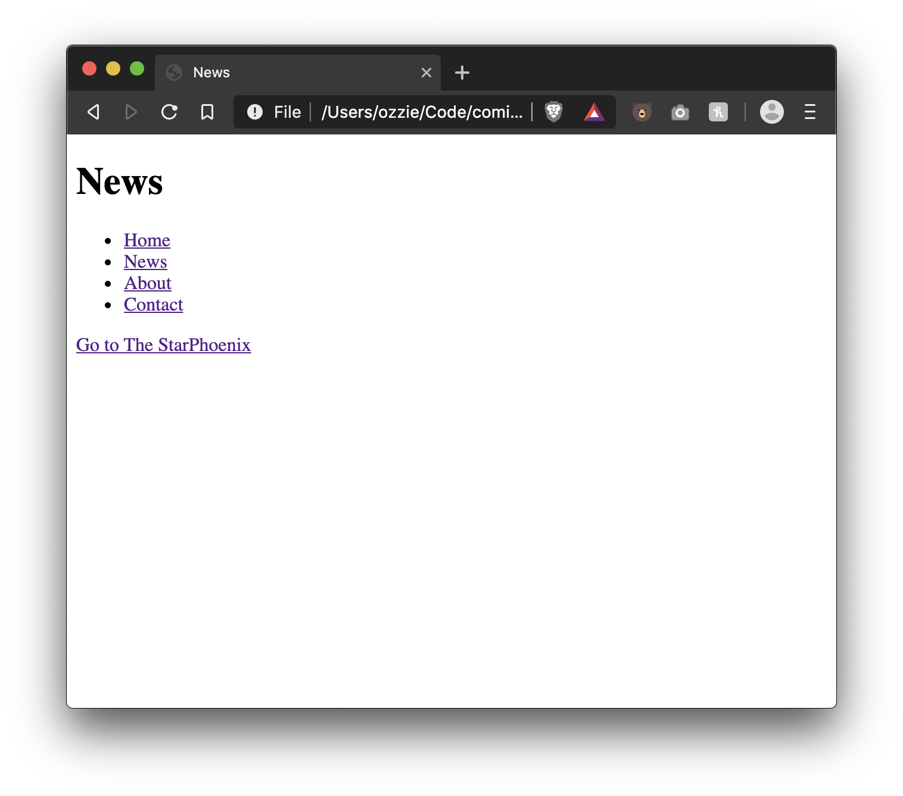
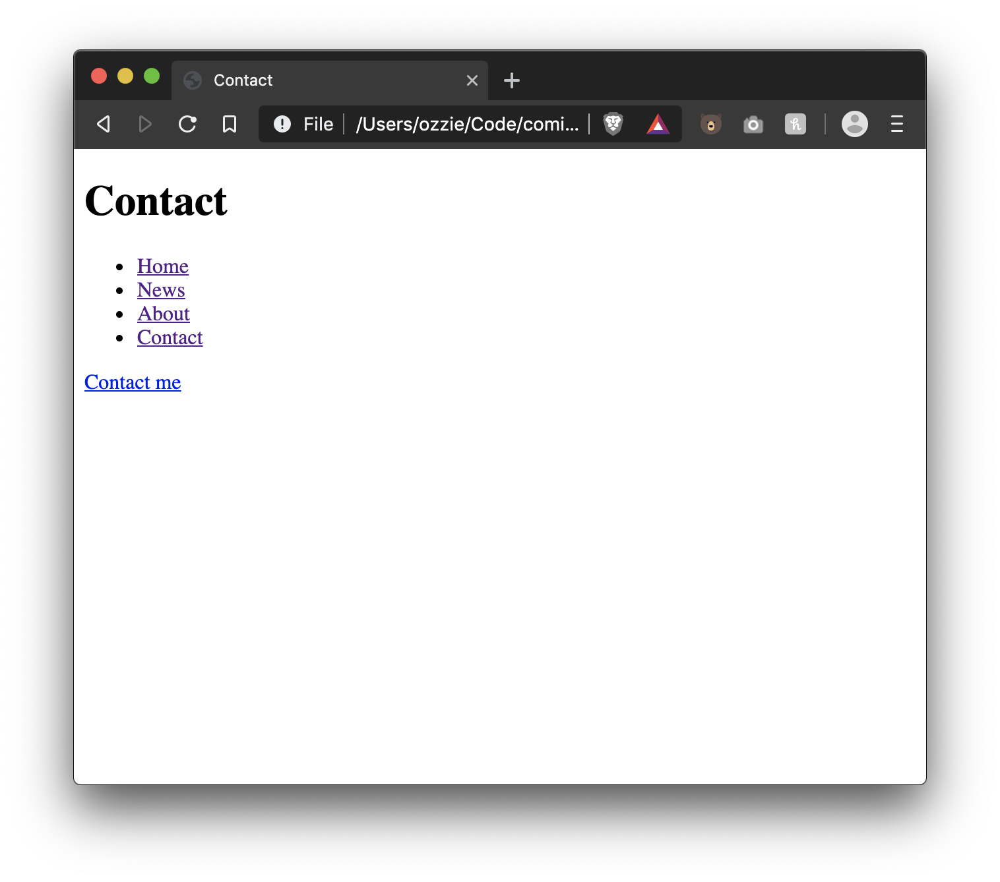

# Lesson 05 - HTML Linking

The `<a>` element (or anchor element) creates a hyperlink to other web pages, files, locations within the same page, email addresses, or any other URL.

Between the opening and the closing tag we can add the link content that the user will click on. The content can be text or html elements.

```html
<a href="other_file.html">Click me I'm a link!</a>
<a href="my_dog.jpg">
  
</a>
<a href="https://google.com">Go to Google</a>
```

## Attributes

- `href` - Required. URL or URL fragment that the hyperlink points to
- `target` - Optional. In what context should we open the url. A context is either a tab, window, or `<iframe>`. This attribute can be one of:
  - `_self`: Load the URL into the same browsing context as the current one. This is the default behavior (set automatically if `target` is not set)
  - `_blank`: Load the URL into a new browsing context. This is usually a tab, but users can configure browsers to use new windows instead
  - `_parent`: Load the URL into the parent browsing context of the current one. If there is no parent, this behaves the same way as `_self`. e.g. if a link is clicked inside an `<iframe>` that has `target="_parent"` it will load in the page that is rendering the `<iframe>` not the `<iframe>` itself,
  - `_top`: Load the URL into the top-level browsing context (that is, the "highest" browsing context that is an ancestor of the current one, and has no parent). If there is no parent, this behaves the same way as `_self`

## Absolute & Relative URLs

`<a>` tags can take absolute or relative urls. [MDN has a good guide on what defines a url](https://developer.mozilla.org/en-US/docs/Learn/Common_questions/What_is_a_URL).

```html
<!-- absolute -->
<a href="http://yahoo.com">Yahoo</a>

<!-- relative -->
<a href="c:\Users\my_name\my_cv.pdf">Look at my CV</a>
```

If we have to files that are siblings or in the same path level we can use the filename as link

```html
To link index.html with about.html
<a href="about.html">About</a>

To link about.html with index.html
<a href="index.html">Go Home</a>

As index is the main file in our site we could use the root
<a href="/">Go Home</a>
```

To link a file that it's inside a folder we'll use the `foldername/filename`

```
/ (root of our folder)
|-- about/
|   |--- about.html
|
|-- index.html
```

```html
To link index.html with the about.html <a href="about/about.html">About</a>
```

Also we can link files from inside a folder to another that's outside. We will add as many ../ as folders we need to exit

```
/ (root of our folder)
|-- about/
|   |-- other_folder/
|     |--- about.html
|
|-- index.html
```

```html
With this folder structure: To link from index.html to about.html we'll use both
folder names
<a href="about/other_folder/about.html">About</a>

To link about.html to index.html we need to exit 2 folders (../../filename)
<a href="../../index.html">Go home</a>
```

## More Linking

Here's a few more things you can do with anchor tags

```html
<!-- Will open the users mail application -->
<a href="mailto:domain@example.com">Email me</a>

<!-- Will open the users calling application -->
<a href="tel:+13061234567">Call me</a>

<!-- Will take the user to the top of the page -->
<a href="#">Go top top</a>

<!-- Will take the user to element that has `id="my-element"` -->
<a href="#my-element">Go my element</a>
<p id="my-element">Imagine i'm way down the page</p>
```

# Exercise Instructions

- Create the following files

```
/ex_5
|-- documents
|   |-- resume.html
|
|-- index.html
|-- news.html
|-- about.html
|-- contact.html
```

- On each document create:
  - Main title with the document name
  - From each document you should be able to nav to the other documents, example: from index.html you can navigate to news.html, about.html and contact.html
- In index.html place 5 auto-generated paragraphs (you can use: https://www.lipsum.com to generate random text)
- In about.html add a link to resume.html
- The contact.html file will have a `mailto` link with a fake email address and `Contact me` as content
- Create a link to [https://thestarphoenix.com/](https://thestarphoenix.com/) in the news.html document and have it open in a new tab
- Create a fake resume in the resume.html document

# Exercise Result







# Further Reading

- [absolute vs relative pathslinks](https://www.coffeecup.com/help/articles/absolute-vs-relative-pathslinks)
- [What are hyperlinks](https://developer.mozilla.org/en-US/docs/Learn/Common_questions/What_are_hyperlinks)
- [Creating hyperlinks](https://developer.mozilla.org/en-US/docs/Learn/HTML/Introduction_to_HTML/Creating_hyperlinks)
- [Dealing with files](https://developer.mozilla.org/en-US/docs/Learn/Getting_started_with_the_web/Dealing_with_files)
