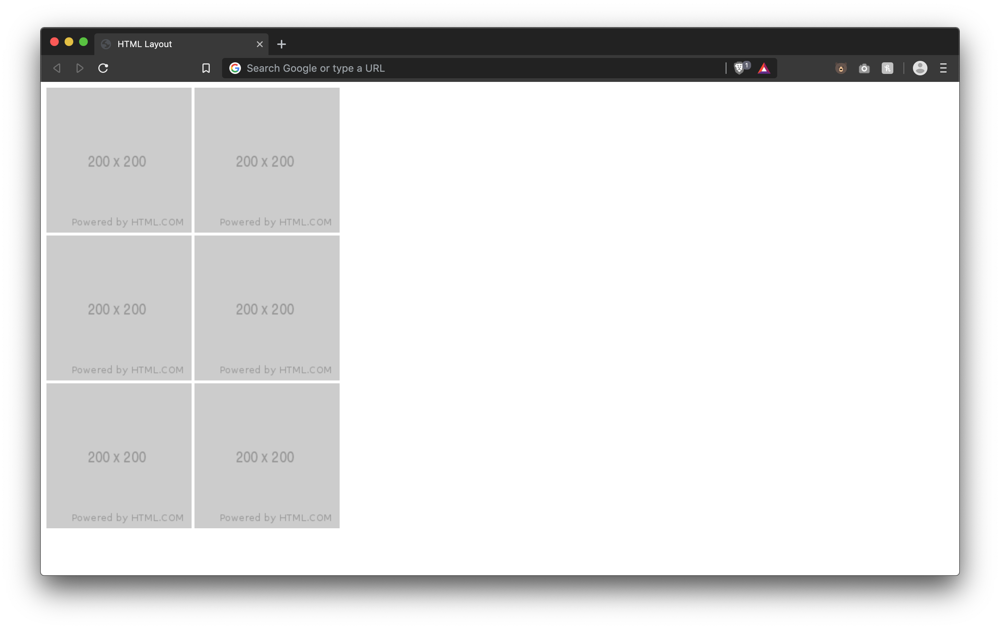
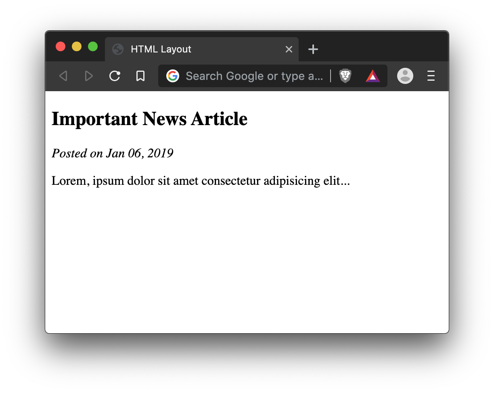
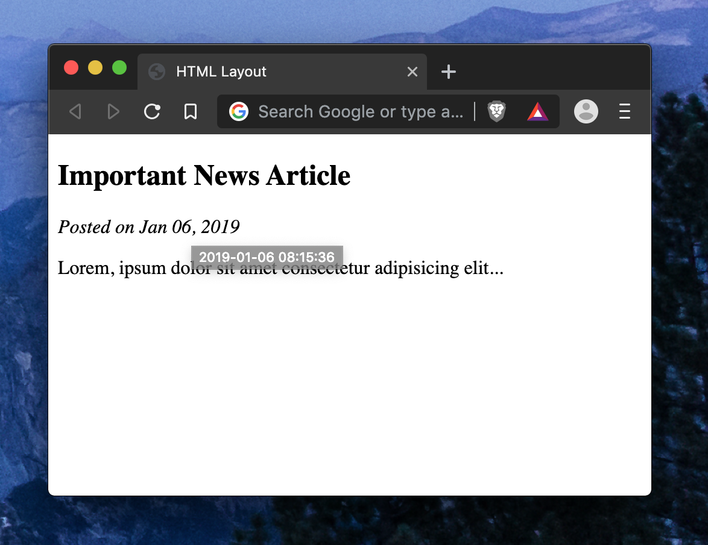
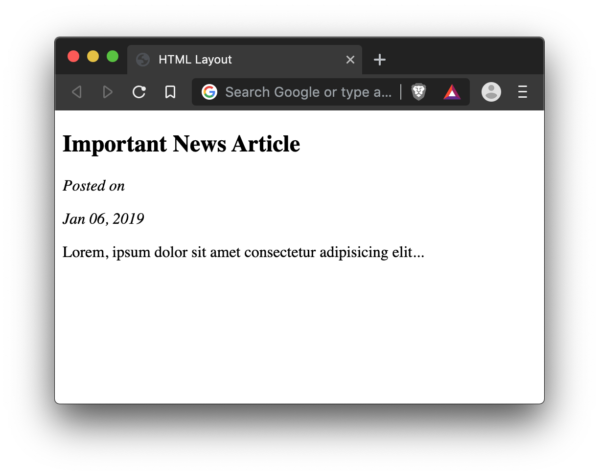

# Lesson 06 - HTML Layout

Now that we have explored a few different html tags that help us produce content, let's take a look at how we can help with the document flow using only HTML.

## Container Elements

There are a set of HTML elements referred to as `containers` that, on their own, do not produce any visible effect. Their purpose is to rather act as a `container` or `parent` to a series of child elements to group them together and assist with document flow.

### `<div>`

From [MDN](https://developer.mozilla.org/en-US/docs/Web/HTML/Element/div):

> The HTML Content Division element (`<div>`) is the generic container for flow content. It has no effect on the content or layout until styled using CSS.

> As a "pure" container, the `<div>` element does not inherently represent anything. Instead, it's used to group content so it can be easily styled using the class or id attributes, marking a section of a document as being written in a different language (using the lang attribute), and so on.

`<div>` elements by default follow the `block` layout, thus shifting everything after it underneath it. We can use a `<div>` to group a series of elements that we want together.

Let's take a real world example. Say you have 6 images that you want to display in a 2x3 grid. By default, images display inline. So if we were to take this:

```html


```

It would show all of the images one next to eachother.


Now that we have our new gained knowledge of `<div>` elements though, we can group them up to the grid that we want.

```html
<div>
  
  
</div>
<div>
  
  
</div>
<div>
  
  
</div>
```

Which will produce the result we're after.



### Semantic alternatives to `<div>`

When needing to group items together, a `<div>` is always the easiest option. However, there are other tags that behave exactly like the `<div>` but give better context as to what content is going inside, or what purpose the content serves. To your average user, they would never notice a difference. But to web-crawlers (like google) and people that require a screen reader it can make a huge difference in their overall experience.

> The `<div>` element should be used only when no other semantic element (such as `<article>` or `<nav>`) is appropriate.

_(descriptions provided by MDN)_

- [`<main>`](https://developer.mozilla.org/en-US/docs/Web/HTML/Element/main) - represents the dominant content of the `<body>` of a document. The main content area consists of content that is directly related to or expands upon the central topic of a document, or the central functionality of an application.
- [`<section>`](https://developer.mozilla.org/en-US/docs/Web/HTML/Element/section) - represents a standalone section — which doesn't have a more specific semantic element to represent it — contained within an HTML document. Typically, but not always, sections have a heading.
- [`<header>`](https://developer.mozilla.org/en-US/docs/Web/HTML/Element/header) - represents introductory content, typically a group of introductory or navigational aids. It may contain some heading elements but also a logo, a search form, an author name, and other elements
- [`<footer>`](https://developer.mozilla.org/en-US/docs/Web/HTML/Element/footer) - represents a footer for its nearest [sectioning content](https://developer.mozilla.org/en-US/docs/Web/Guide/HTML/Content_categories#Sectioning_content) or [sectioning root element](https://developer.mozilla.org/en-US/docs/Web/Guide/HTML/Sections_and_Outlines_of_an_HTML5_document#Sectioning_roots). A footer typically contains information about the author of the section, copyright data or links to related documents.
- [`<aside>`](https://developer.mozilla.org/en-US/docs/Web/HTML/Element/aside) - represents a portion of a document whose content is only indirectly related to the document's main content. Asides are frequently presented as sidebars or call-out boxes.
- [`<nav>`](https://developer.mozilla.org/en-US/docs/Web/HTML/Element/nav) - represents a section of a page whose purpose is to provide navigation links, either within the current document or to other documents. Common examples of navigation sections are menus, tables of contents, and indexes.
- [`<article>`](https://developer.mozilla.org/en-US/docs/Web/HTML/Element/article) - represents a self-contained composition in a document, page, application, or site, which is intended to be independently distributable or reusable (e.g., in syndication). Examples include: a forum post, a magazine or newspaper article, or a blog entry.

### `<span>`

`<span>`, like `<div>`, is a container element that provides no default features other than to contain content. However, `<span>` is an `inline` container which makes it ideal for wrapping other `inline` elements like free-floating text.

We will cover more uses of `<span>` elements when we get to CSS, but for now let's take a look at a simple example.

Let's say you have a blog article that shows the date it was posted in a nice and short format.

```html
<article>
  <h1>Important News Article</h1>
  <p><em>Posted on Jan 06, 2019</em></p>
  <p>
    Lorem, ipsum dolor sit amet consectetur adipisicing elit...
  </p>
</article>
```



But what if we want to know the exact time that it was posted? It wouldn't look very good in our layout to have that level of detail, but a common pattern in website development is to show the full timestamp of the date when you hover over top of it.

We can accomplish this by putting a `title` attribute on the element that, when hovered, will show this text.

> The `title` attribute is a global attribute that can be applied to any HTML element. It contains text representing advisory information related to the element it belongs to.

> More information about `title` on [MDN](https://developer.mozilla.org/en-US/docs/Web/HTML/Global_attributes/title)

Since we want this only on the date and not the whole "Posted on..." text, we would need to somehow add a tag around only the date.

`<span>` to the rescue!

```html
<article>
  <h1>Important News Article</h1>
  <p>
    <em>Posted on <span title="2019-01-06 08:15:36">Jan 06, 2019</span></em>
  </p>
  <p>
    Lorem, ipsum dolor sit amet consectetur adipisicing elit...
  </p>
</article>
```



Notice how when we added the span, the content does not shift!

If we were replace that `<span>` with a `<div>`, you can see the difference:

```diff
<article>
  <h1>Important News Article</h1>
  <p>
-    <em>Posted on <span title="2019-01-06 08:15:36">Jan 06, 2019</span></em>
+    <em>Posted on <div title="2019-01-06 08:15:36">Jan 06, 2019</div></em>
  </p>
  <p>
    Lorem, ipsum dolor sit amet consectetur adipisicing elit...
  </p>
</article>
```



# Exercise Instructions

# Exercise Result

# Further Reading

- [MDN div](https://developer.mozilla.org/en-US/docs/Web/HTML/Element/div)
- [MDN span](https://developer.mozilla.org/en-US/docs/Web/HTML/Element/span)
