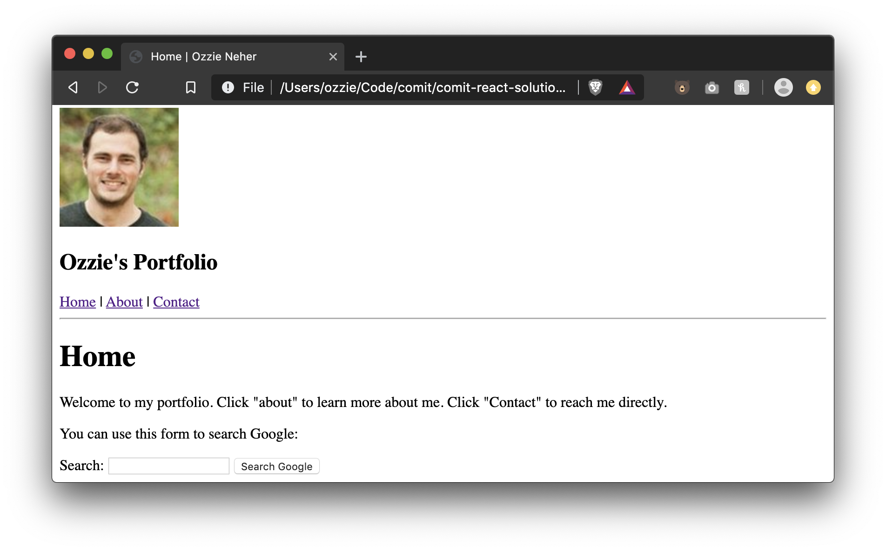
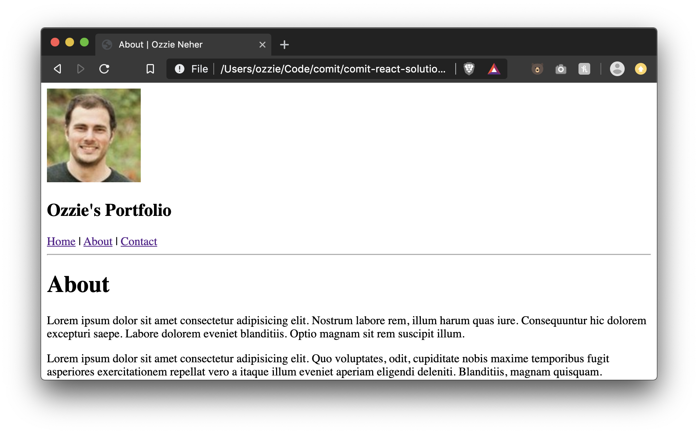
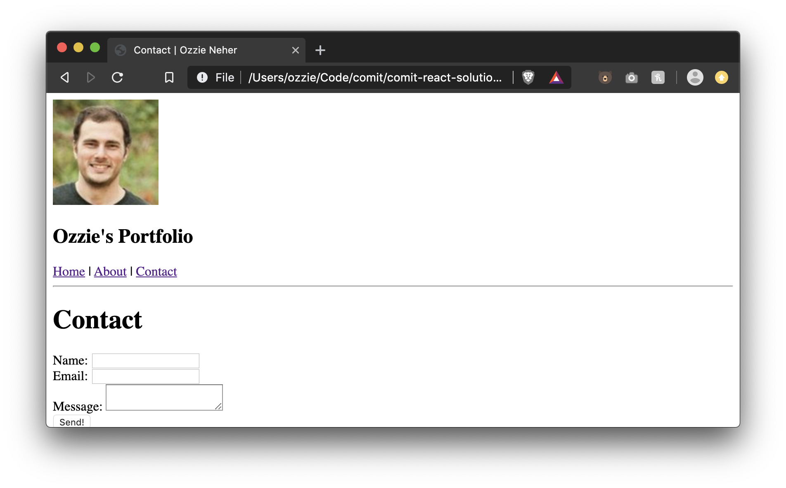
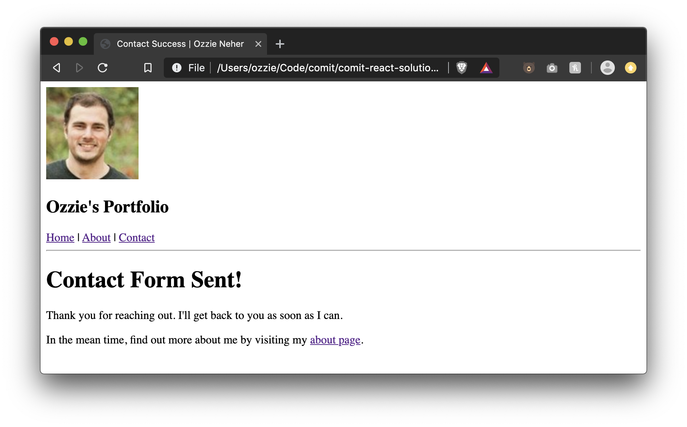

# Lesson 08 - HTML Site

We've covered the foundational concepts of HTML over the past few lessons. Let's take this time to put everything together and build a multiple page website for yourself. It will look pretty plain but once we get into styling we will come back to this same code and make it prettier!

# Exercise Instructions

We're going to build a fake website for you that contains a home page, an about page, and a contact page with a form.

Have some fun with it! Add your own spin to these pages. Think it needs more images? Load it up! These are only guidelines.

Every page should have:

- A document `<title>` in the format of `<Page Title> | <Your Name>`, e.g. `Home | Ozzie Neher`
- A `<header>` with

  - An image of you (or take one from https://uifaces.co)
    - if your image is too big, resize it using the `width=""` and `height=""` attributes of the `` tag
  - The second level heading `<Your Name>'s Portfolio`
  - A `<nav>` with a link to each page
  - A `
` after the header
  - A `<main>` tag should contain all of the page specific content below

- Create a home page, `index.html`
  - Add a title, "Home"
  - Add a short introduction for people to read, welcoming them to your site
  - Add a form that will allow people to search google
    - Create the form with `method="GET"` and `action="https://google.ca/search"`
    - Place a text input with the name of `q` (this is important! google is expecting this)
    - Place a submit button that says "Search Google"
- Create an about page, `about.html`
  - Add a title, "About"
  - Add 3 paragraphs about you, or lorem ipsum
- Create a contact page, `contact.html`
  - Add a title, "Contact"
  - Create a form with the `method="GET"` and `action="contact-success.html"`
  - Create 3 inputs, Name, Email, and Message
    - All 3 should be required
    - Message should be a `<textarea>`
  - Create a submit button
- Create a contact success page, `contact-success.html`
  - Add a title, "Contact Form Sent!"
  - Add a paragraph, "Thank you for reaching out. I'll get back to you as soon as I can."
  - Add another paragraph, "In the mean time, find out more about me by visiting my about page."
    - "about page" in the above paragraph should link to your about page

# Exercise Result

