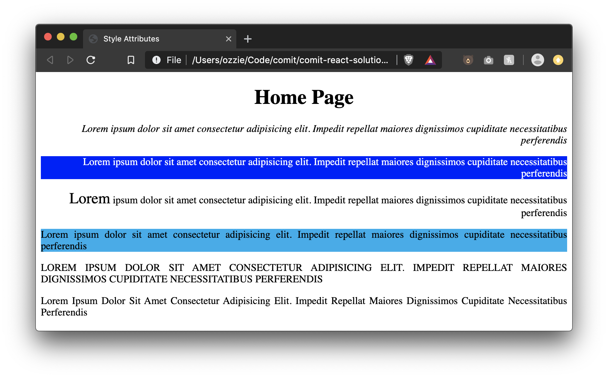

# Lesson 09 - CSS Style Attribute

Up until now, our websites have been very plain. The reason for this is that it's important to understand the _why_ of everything. Why we use HTML. Why we use CSS. If we introduce all of these concepts at once, lines start to get blurred over what technology does what.

As we learn CSS, we will work our way up from the least efficient, to the most efficient ways of accomplishing things while also learning all of the rules.

To begin we'll take a look at the `style` attribute that can be applied to any HTML tag.

## Cascading Style Sheets (CSS)

We've learned that HTML builds the content of our web page, but does how do we spice it up? Enter CSS.

## Style Attribute

Here's what it would look like to change the text color and font size of an `<h1>`

```html
<h1 style="color: blue; font-size: 32px">My Website</h1>
```

By using the `style` attribute we can directly set `property: value` styles on the element (and set multiple by separating it by a semi-colon `;`).

Every property has different kinds of values that it can take in. In our example above:

- `color` - possible values
  - A [keyword](https://developer.mozilla.org/en-US/docs/Web/CSS/color_value#Color_keywords), e.g. `blue` or `red`
  - A [hexadecimal](https://stackoverflow.com/questions/22239803/how-does-hexadecimal-color-work), e.g. `#00FF00`
  - A [rgb](https://en.wikipedia.org/wiki/RGB_color_model#Geometric_representation), e.g. `rgb(255, 0, 0)`
  - A rgba, like rgb but with alpha (opicty) as the last argument, e.g. `rgba(255, 0, 0, 1)`

## More Properties

Let's explore a few more properties that we can play around with. There are MANY more but we'll take a look at these to get started.

### background

We can change the background color of an element using css by setting the `background` property:

```html
<div style="background: red;">
  My background will be red but my text will be black
</div>
```

[More on background on MDN](https://developer.mozilla.org/en-US/docs/Web/CSS/background)

### font-family

We can pick the font we want the element to use via the `font-family` property:

```html
<h1 style="font-family: sans-serif">My Website</h1>
<p>I will have a the default serif font</p>
```

Browsers and operating systems supply a few default fonts that you can use freely, but if you want something out of that realm you will have to download it and serve it on your website.

Some defaults include:

- `serif`
- `sans-serif`
- `Arial`
- `Times New Roman`

[More on font family on MDN](https://developer.mozilla.org/en-US/docs/Web/CSS/font-family)

### font-weight

We can set how heavy (bold/thick) a font is by setting the `font-weight` property:

```html
<h1 style="font-weight: 400;">
  I will be the same weight as a default paragraph
</h1>
```

Font weights can be set using a keyword (e.g. `bold`), or a number (usually an even hundred, e.g. 100, 600, 900). What font weight you can choose depends on what font family you are using.

[Full list of font weights on MDN](https://developer.mozilla.org/en-US/docs/Web/CSS/font-weight)

### font-style

Font style allows us to choose if a font is italic or normal, similar to how we would do it using the html tag `<em>`:

```html
<p style="font-style: italic;">I'm italicized</p>
```

[More on font-style on MDN](https://developer.mozilla.org/en-US/docs/Web/CSS/font-style)

### text-transform

text-transform allows us to uppercase, lowercase, or capitalize text:

```html
<p style="text-transform: uppercase;">I'm all uppercase</p>
<p style="text-transform: lowercase;">
  I'M WRITTEN USING CAPS BUT AM DISPLAYED AS ALL LOWERCASE
</p>
<p style="text-transform: capitalize;">each word should be capitalized</p>
```

[More on text-transform on MDN](https://developer.mozilla.org/en-US/docs/Web/CSS/text-transform)

### text-align

The text-align property describes how inline content like text is aligned in its parent block element. This property align does not control the alignment of block elements, only their inline content (like the text).

We can use the following values: `inherit`, `left`, `right`, `center`, `justify`, `justify-all`, `start`, `end`, `match-parent`

- justify-all: works in the same way tha justify, but also forces the last line to be justified
- start: same as left if direction is left-to-right and right if direction is right-to-left
- end: same as right if direction is left-to-right and left if direction is right-to-left
- inherit: specifies that a property should inherit its value from its parent element
- match-parent: similar to inherit, but the values start and end are calculated according to the parent's direction and are replaced by the appropriate left or right value

```html
<div style="text-align: center;">
  <h1>I'm Centered</h1>
</div>

<!-- Adding this to the div makes all children align right -->
<div style="text-align: right;">
  <p>
    Lorem, ipsum dolor sit amet consectetur adipisicing elit. Commodi itaque, ad
    quo eius tempora reiciendis suscipit porro nihil, voluptate facere, cum
    totam molestiae ut earum quod sapiente non amet provident.
  </p>
  <p>
    Lorem, ipsum dolor sit amet consectetur adipisicing elit. Commodi itaque, ad
    quo eius tempora reiciendis suscipit porro nihil, voluptate facere, cum
    totam molestiae ut earum quod sapiente non amet provident.
  </p>
</div>

<p style="text-align: left;">
  Lorem, ipsum dolor sit amet consectetur adipisicing elit. Commodi itaque, ad
  quo eius tempora reiciendis suscipit porro nihil, voluptate facere, cum totam
  molestiae ut earum quod sapiente non amet provident.
</p>
```

# Exercise Instructions

Complete all of the steps below using the `style=""` attribute

- Create an `index.html` file
- Add a document title "Style Attributes"
- Create a `<header>` with a title, "Home Page"
  - Center the title inside the header
- Create a container (`<div>`) and place 3 paragraphs inside, all aligned to the right
  - try to align all 3 paragraphs using only 1 elements style attribute
  - italicize the whole 1st paragraph (without using `<em>` tag)
  - set the 2nd paragraphs background to `blue` and color to `rgb(255, 255, 255)`
  - set the font size of the first word of the 3rd paragraph to `24px`. (hint: lesson 06 we learned about an inline container element that can help us isolate text so that we can style it)
- Create 3 more paragraphs, all justified
  - set the 1st paragraph's background to a hex color of your choice
    - you can use this website to pick a color https://htmlcolorcodes.com/color-picker/
  - set the 2nd paragraph to be ALL CAPS
  - set the 3rd paragraph to be Capitalized

# Exercise Result



# Further Reading

- [MDN background](https://developer.mozilla.org/en-US/docs/Web/CSS/background)
- [MDN color](https://developer.mozilla.org/en-US/docs/Web/CSS/color)
- [MDN font-family](https://developer.mozilla.org/en-US/docs/Web/CSS/font-family)
- [MDN font-weight](https://developer.mozilla.org/en-US/docs/Web/CSS/font-weight)
- [MDN font-size](https://developer.mozilla.org/en-US/docs/Web/CSS/font-size)
- [MDN font-style](https://developer.mozilla.org/en-US/docs/Web/CSS/font-style)
- [MDN text-transform](https://developer.mozilla.org/en-US/docs/Web/CSS/text-transform)
