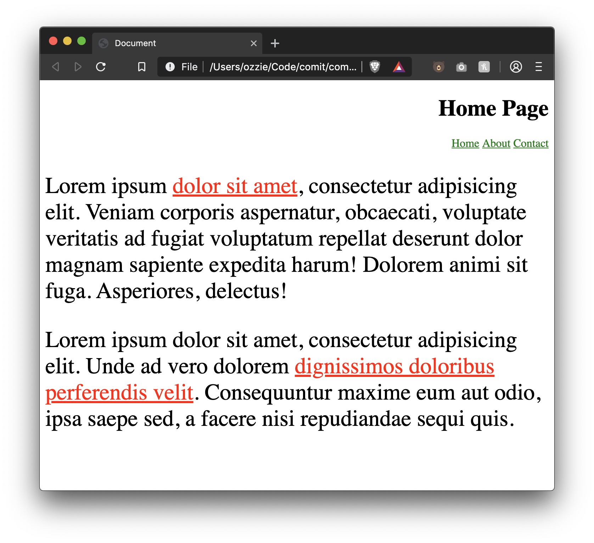
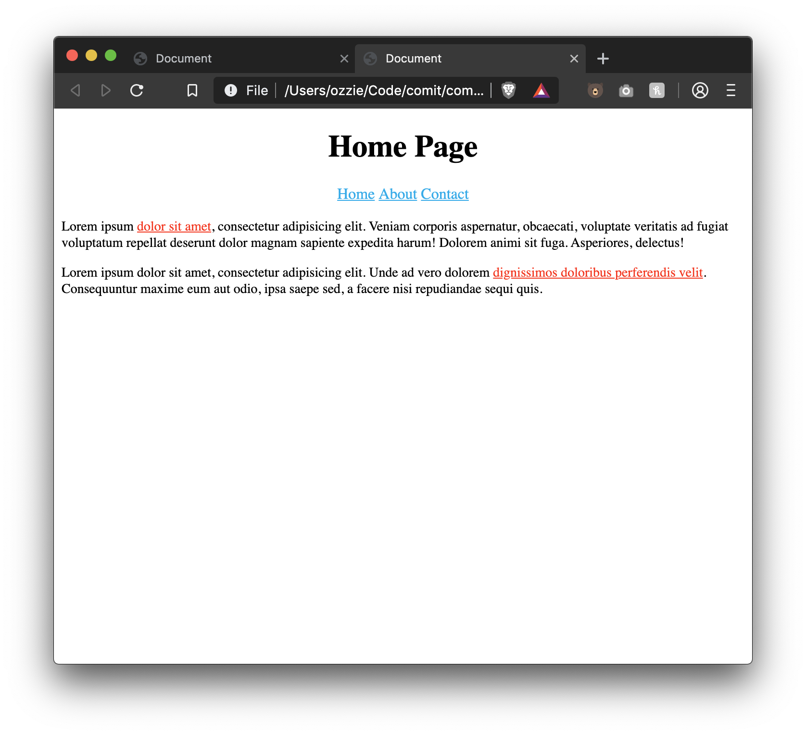

# Lesson 11 - CSS Specificity

Now that we know about the different CSS selectors, what happens when we target the same element using multiple selectors?

Look at the folowing code, what color will the paragraph be?

```html
<html>
  <head>
    <style>
      p {
        color: red;
      }
      #p-id {
        color: blue;
      }
      .p-class {
        color: green;
      }
    </style>
  </head>
  <body>
    <p id="p-id" class="p-class" style="color: brown">
      What color will my text be?
    </p>
  </body>
</html>
```

...

...

If you thought `brown`, you're correct!

But why does it pick brown? CSS has a concept of "specificity", meaning certain _selectors_ are _more specific_ than others.

CSS Selectors priority in order from MOST to LEAST

1. `style=""` - style attribute
2. `#p-id` - id selector
3. `.p-class` - class selector
4. `p` - element selector

In a specificity tie, the last rule defined wins.

That means if you had the following styles

```css
p {
  color: red;
}
p {
  color: green;
}
```

Green would be the color that is chosen because both selectors have the same specificity but the green one is defined AFTER the red one.

## Combining Selectors

We can combine selectors if we need to be more specific in our styling in order to better target our elements.

Here is a moderately complex example, but a common pattern you will see in web development.

- We say that we want all `<a>` tags to be orange, easy enough
- Then we define a generic `.active` class that we can add to any element to make its color "green"
- Then we say that we don't want links in our nav that have an `.active` class to be green and instead we want them to be pink (deeppink)
- This way, our nav links stay orange. Our `<p>` in the body stays green (because it has `.active`). And our "About" link in our nav is pink (even though it has the `.active` class that would normally make it green).

```html
<html>
  <head>
    <style>
      nav a {
        color: orange;
      }

      .active {
        color: green;
      }

      nav a.active {
        color: deeppink;
      }
    </style>
  </head>
  <body>
    <nav>
      <ul>
        <li><a href="#">Home</a></li>
        <li><a href="#" class="active">About</a></li>
        <li><a href="#">Contact</a></li>
      </ul>
    </nav>

    <p class="active">I'm active</p>
  </body>
</html>
```

We combined two selectors together by placing them directly after one another, `a.active`. Note that this is different than the "descendant combinator" from the last lesson that is separated by a space, `a .active`.

```css
/**
 (no space) This says "Target the <a> tag that has a class="active" on it
*/
a.active {
}

/**
 (with space) This says "Target the <a> tag that has a DESCENDANT that has class="active"
*/
a .active {
}
```

`a.active` is more specific than `.active` because it has two selectors on it vs the one.

# Exercise Instructions

- Open up `index.html` inside this folder (it has already been created)
- **Without removing the existing CSS in this file, and without using the `style=""` attribute**, use _more specific_ styles to make the following changes:
  - Set the `<nav>` links color to `#00aced`
  - Center align the text in the `<header>`
  - Shrink the paragraphs to be a more normal font size, say `14px`

# Exercise Results

Before:



After:



# Further Reading

- [CSS Specificity on MDN](https://developer.mozilla.org/en-US/docs/Web/CSS/Specificity)
- [Specifics on Specificity - CSS Tricks](https://css-tricks.com/specifics-on-css-specificity/)
- [Specificity in 4 minutes](https://www.youtube.com/watch?v=In78mSOHmls)
