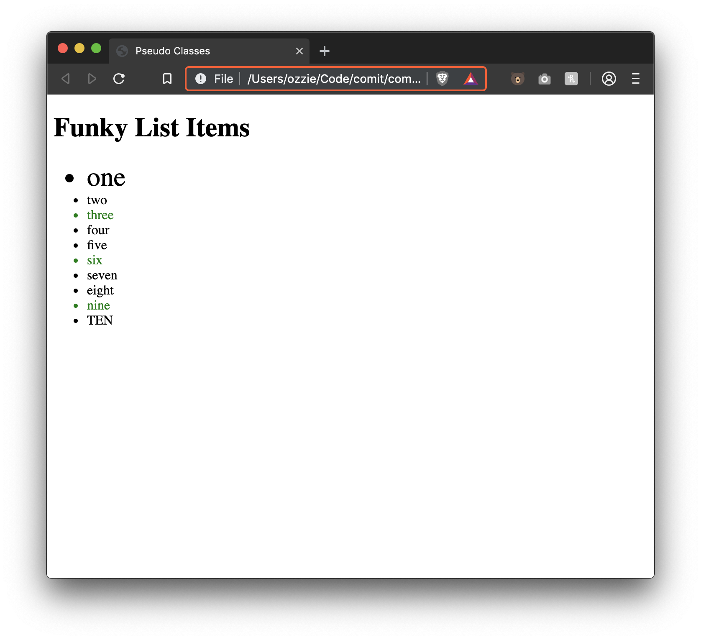

# Lesson 12 - CSS Pseudo Classes

[From MDN:](https://developer.mozilla.org/en-US/docs/Web/CSS/Pseudo-classes)

> A CSS pseudo-class is a keyword added to a selector that specifies a special state of the selected element(s). For example, `:hover` can be used to change a button's color when the user's pointer hovers over it.

## Available Pseudo Classes

### `:hover`

Apply styles to an element only when it is being hovered

```css
button:hover {
  background: green;
}
```

### `:first-child`

Target the first element among a group of sibling elements

```html
<html>
  <head>
    <style>
      div p:first-child {
        background: blue;
      }
    </style>
  </head>
  <body>
    <div>
      <p>I will be targeted</p>
      <p>But I will not</p>
    </div>

    <div>
      <div>Not a p tag so i won't be targeted</div>
      <p>I'm not the first child so i have no style</p>
      <p>Same here</p>
    </div>
  </body>
</html>
```

Note that in the second div, since the `<p>` isn't the first child it does not get styled

#### Similar

- [`:last-child`](https://developer.mozilla.org/en-US/docs/Web/CSS/:last-child)

### `:first-of-type`

Like `:first-child` but does not need to be the very first child inside of a container, just the first of its type. If we take the example from `:first-child` but turn it to `:first-of-type`, we will see a change

```html
<html>
  <head>
    <style>
      div p:first-of-type {
        background: blue;
      }
    </style>
  </head>
  <body>
    <div>
      <p>I will be targeted</p>
      <p>But I will not</p>
    </div>

    <div>
      <div>Not a p tag so i won't be targeted</div>
      <p>I'm the first p tag in the div so I'm targeted!</p>
      <p>But I still am not</p>
    </div>
  </body>
</html>
```

#### Similar

- [`:last-of-type`](https://developer.mozilla.org/en-US/docs/Web/CSS/:last-of-type)

### `:nth-child`, `:nth-of-type`

Like `:first-child` and `:first-of-type`, `:nth-child` and `:nth-of-type` work the same but allow you to specify the position in a group of siblings.

Takes in a value representing the position we want to select using parenthesis (`:nth-child(2)`).

Possible values:

- a number, `:nth-child(4)` - targets the 4th child in a group
- a keyword
  - `even`, `:nth-child(even)` - targets every even element in a group
  - `odd`, `:nth-child(odd)` - targets every odd element in a group
- functional notation
  - can provide a number, followed by `n` to repeat every `n` times
    - `:nth-child(4n)` - would target every 4th element
  - can use the above notation and specify a starting position by adding that number
    - `:nth-child(4n + 3)` would repeat every 4th element BUT would start at the 3rd element in the list

```html
<html>
  <head>
    <style>
      div p:nth-child(2) {
        background: blue;
      }
    </style>
  </head>
  <body>
    <div>
      <p>I will be targeted</p>
      <p>But I will not</p>
    </div>

    <div>
      <div>Not a p tag so i won't be targeted</div>
      <p>I'm the first p tag in the div so I'm targeted!</p>
      <p>But I still am not</p>
    </div>
  </body>
</html>
```

# Exercise Instructions

- Create a file, `index.html`
- Set the document title to be "Pseudo Classes"
- Create a heading with the title "Funky List Items"
- Create an unordered list with 10 items in it
  - Set the text in each list item to anything
- Apply the following styles **using pseudo classes**
  - When hovering over the 2nd item in the list, set its background to red and text to white
  - Set the first item in the list to be font size `32px`
  - Set every 3rd item to have a text color of green
  - Set the last item to be all uppercase text

# Exercise Results



# Further Reading

- [VIDEO - How does nth-child really work? 3m09s](https://www.youtube.com/watch?v=KIIktcWu6hc)
- [VIDEO - CSS Tutorial for Beginners - nth child Selector - 3m15s](https://www.youtube.com/watch?v=8ltqU8rBM8Y)
