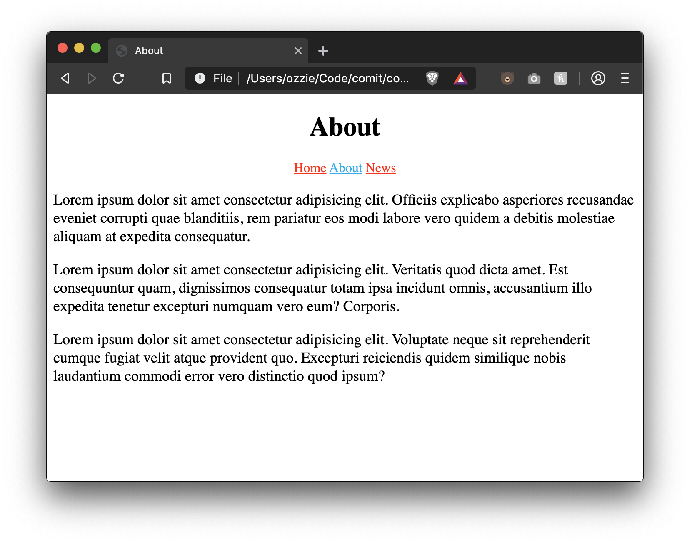
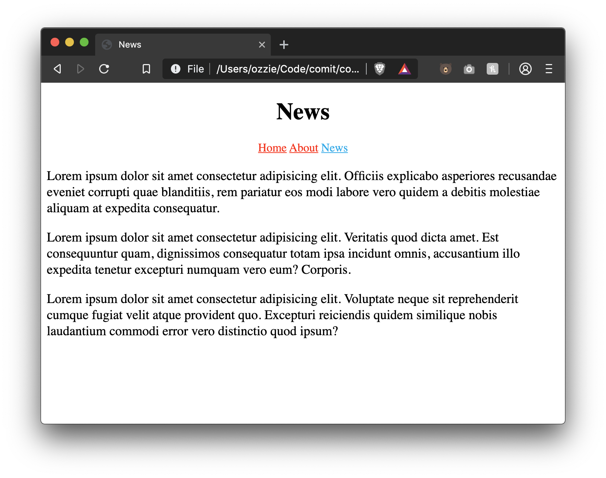

# Lesson 13 - CSS External Files

Placing our CSS inside of a `<style>` tag works great, but what if our website has multiple pages? We'd have to copy + paste that `<style>` tag onto every page. Then what happens when we want to update one of the styles? We'd have to make that change on every html file in order for the changes to take effect accross our website.

Instead of doing that, we can write our CSS inside of a `.css` file and include that in our HTML using a tag. That way, we write all of our CSS once in this file and just include it in every HTML file on our website.

## `<link />` tag

To include a css file in your HTML we can use a `<link />` tag.

Imagine we have the following files:

```
my_website/
  | index.html
  | styles.css
```

Inside of our `index.html` we could include `style.css` by doing the following:

```html
<html>
  <head>
    <link rel="stylesheet" href="style.css" />
  </head>
  <body>
    <p>CSS File Linking</p>
  </body>
</html>
```

The link tag has two required attributes

- `href` - tells the link where the external resource is located. Can be a relative or absolute url
- `rel` - names a relationship of the linked document to the current document. The attribute must be a space-separated list of the [link types values](https://developer.mozilla.org/en-US/docs/Web/HTML/Link_types).

# Exercise Instructions

- Create 3 files - `index.html`, `about.html`, `news.html`
- For each file:
  - Set the document title to the page's name, e.g. "About"
  - Add a `<header>` with a title inside containing the page's name, e.g. "About"
  - Add a `<nav>` inside the header with links to each page
  - Add 3 paragraphs of content to each page
- Create a file, `style.css`
- Apply the following styles to your pages by writing CSS inside of `style.css`
  - Center the header text
  - Make the nav links red
  - Make the paragraphs have a font size of 18px
  - Create one CSS class that you can add to the current page's nav link that will set its color to `#00aced`
- Don't forget to `<link />` your CSS file in each of your `.html` files!

# Exercise Results





# Further Reading

- [link tag on MDN](https://developer.mozilla.org/en-US/docs/Web/HTML/Element/link)
