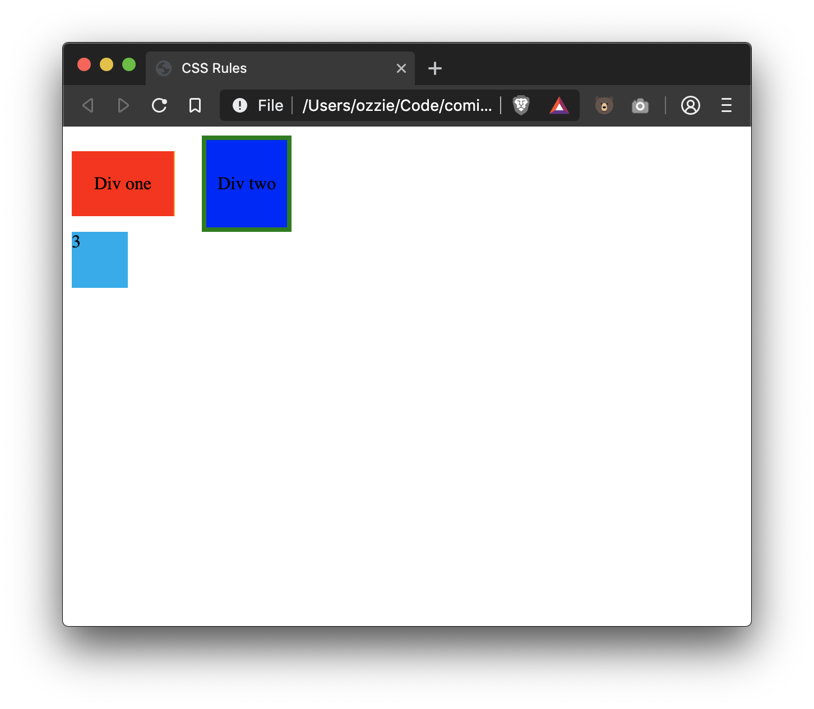

# Lesson 14 - CSS More Rules

Let's introduce some more properties that we can apply to our websites!

## Borders

We can give our elements a border by using the `border` rule:

```css
p {
  border: 1px solid #00aced;
}
```

Would give all paragraphs a solid blue 1px border. The order is as follows:

1. Width of the border
2. The style of the border, e.g. `solid` or `dashed`. [Full list of border styles here](https://developer.mozilla.org/en-US/docs/Web/CSS/border-style)
3. The color of the border

We can also specify these one at a time instead of all at once

```css
p {
  border-width: 1px;
  border-style: solid;
  border-color: #00aced;
}
```

Here is a few more border properties we can apply:

- [`border-width`](https://developer.mozilla.org/en-US/docs/Web/CSS/border-width) - sets the width of the border
- [`border-style`](https://developer.mozilla.org/en-US/docs/Web/CSS/border-style) - sets the style of the border
- [`border-color`](https://developer.mozilla.org/en-US/docs/Web/CSS/border-color) - sets the color of the border
- [`border-radius`](https://developer.mozilla.org/en-US/docs/Web/CSS/border-radius) - rounds the edges of the border by `n` pixels

You can also apply a border to only certain sides, or customize each side using the specific properties for that side:

- `border-bottom` - shorthand set the border for only the bottom (`border-bottom: 1px solid black`)
- `border-bottom-width`
- `border-bottom-style`
- `border-bottom-color`

You can replace `bottom` in the above rules with any of the following to target a specific side: `left`, `right`, `top`, `bottom`.

## Padding

Padding is the space WITHIN the box of our element. We can demonstrate this easily using borders:

```html
<html>
  <head>
    <style>
      p {
        border: 1px solid red;
      }
    </style>
  </head>
  <body>
    <p>Example</p>
  </body>
</html>
```

If you render this, you can see that the border hugs the text and there is not much breathing room. If we want to increase the space between the border and the text we can set the PADDING of the element.

```html
<html>
  <head>
    <style>
      p {
        border: 1px solid red;
        padding: 10px;
      }
    </style>
  </head>
  <body>
    <p>Example</p>
  </body>
</html>
```

If you refresh the page, you'll see your `<p>` tag has some more space inside its box now.

Padding can be set in a few ways:

- `padding: 10px` - would add 10px of padding to the top, left, right, and bottom of the element
- `padding: 10px 20px` - would add 10px to the top and bottom, and 20px to the left and right of the element
- `padding-top: 10px` - would add 10px padding to only the top of the element
  - repeat this for `left`, `right`, and `bottom` as well

If your element is an `inline` element, it WILL NOT apply any top or bottom padding.

## Margin

Padding is the space INSIDE the box of the element, but margin is the space AROUND the element. We use margin when we want to PUSH an element AWAY from another.

Let's illustrate this similar to how we visualized the padding. We'll create a heading with a red border around it, and a paragraph underneath.

```html
<html>
  <head>
    <style>
      h1 {
        border: 1px solid red;
      }
    </style>
  </head>
  <body>
    <h1>My Blog</h1>
    <p>Lorem ipsum dolor...</p>
  </body>
</html>
```

As we can see, the elements are fairly close together. What if we want to push the `<p>` tag away from the heading to give it some room?

```html
<html>
  <head>
    <style>
      h1 {
        border: 1px solid red;
        margin-bottom: 100px;
      }
    </style>
  </head>
  <body>
    <h1>My Blog</h1>
    <p>Lorem ipsum dolor...</p>
  </body>
</html>
```

By adding `margin-bottom: 100px` to the `<h1>` we pushed the `<p>` tag away by 100px! Here you can also see that the red box around the heading did not move because we increased the space OUTSIDE the box, not inside like padding.

Margin is set exactly like padding:

- `margin: 10px` - would add 10px of margin to the top, left, right, and bottom of the element
- `margin: 10px 20px` - would add 10px margin to the top and bottom, and 20px to the left and right of the element
- `margin-top: 10px` - would add 10px margin to only the top of the element
  - repeat this for `left`, `right`, and `bottom` as well

If your element is an `inline` element, it WILL NOT apply any top or bottom margin.

## Width

You can set the width of an element using the `width` property. You can use absolute values, e.g. `50px`, or percentage values, e.g. `75%`.

```css
div {
  width: 50%;
}
```

When using percentage values, the percentage is calculated based on the width of the parent.

If your element is an `inline` element, you CANNOT set the width of it.

## Height

You can set the height of an element using the `height` property. You can use absolute values, e.g. `50px`, or percentage values, e.g. `75%`.

```css
div {
  height: 50%;
}
```

When using percentage values, the percentage is calculated based on the height of the parent.

If your element is an `inline` element, you CANNOT set the height of it.

## Display

In lesson 02 we learned about elements that are `block` and `inline`, but these are only defaults. We can override this using the `display` css property.

```css
div {
  display: inline;
}
```

Would make all `<div>` tags display inline instead of being block!

Display has a bunch of different values it can take, but here are a few common ones:

- `none` - hide the element
- `block` - make the element display like a block element (take up full width)
- `inline` - make the element display like an inline element (take up only its content space)
- `inline-block` - behaves like `inline` but with a few differences
  - can specify a `width` and `height` attribute
  - respects top/bottom `padding` and `margin`

[For a full list, refer to MDN](https://developer.mozilla.org/en-US/docs/Web/CSS/display)

# Exercise Instructions

- Create a file, `index.html`
- Set its document title to "CSS Rules"
- Create one `<div>`
  - Set its content to "Div one"
  - Give it a background color of red
  - Set its padding to 20px
  - Set its display to `inline-block`
  - Give it a right border of `1px solid orange`
- Create a second `<div>`
  - Set its content to "Div two"
  - Give it a background color of blue
  - Set its left and right padding to 10px
  - Set its top and bottom padding to 30px
  - Set its display to `inline-block`
  - Give it a full border of `4px solid green`
- Push the second div away from the first by giving the first div a margin right of `20px`
- Create a third `<div>`
  - Give it a height and width of `50px`
  - Set the background to `#00aced`
  - Set the text content to "3"
- Create a fourth `<div>`
  - Set the text content to "I am hidden"
  - Give it a display of `none`

# Exercise Results



# Further Reading

- [CSS Borders](https://developer.mozilla.org/en-US/docs/Web/CSS/border)
