# Lesson 17 - Copying Google

I find one of the best way to practice what we learn is to recreate what already exists! Unlike the last lesson where you had some creative freedom in what went on your website, this one we're going to recreate it exactly as it looks on [https://google.ca](https://google.ca). By doing this we do not need to spend time thinking or worrying about what needs to be done, since it's all layed out for us already!

Here's what we'll be building:

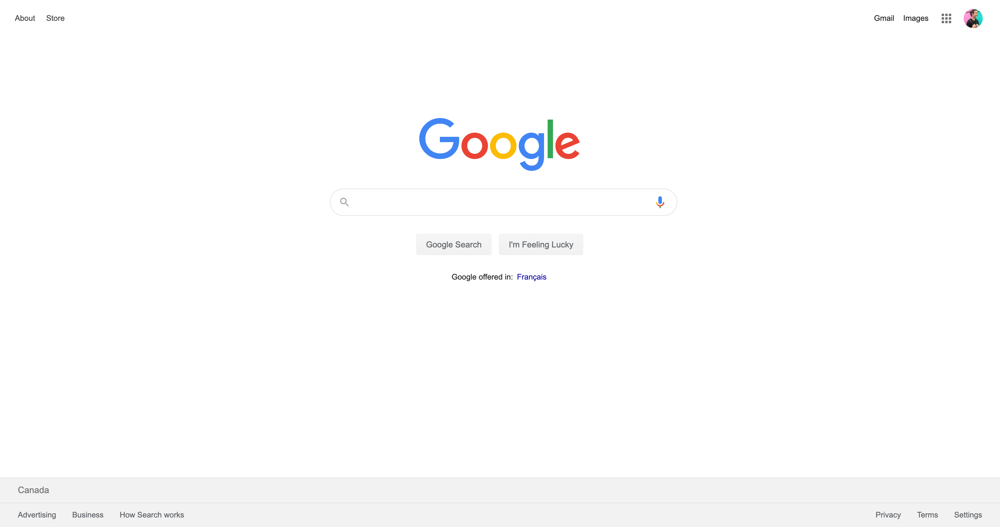

What I like to do before starting work is to break things out into sections so I know what groups I will need. I do this all mentally now, but let's look at what an image representation might look like:

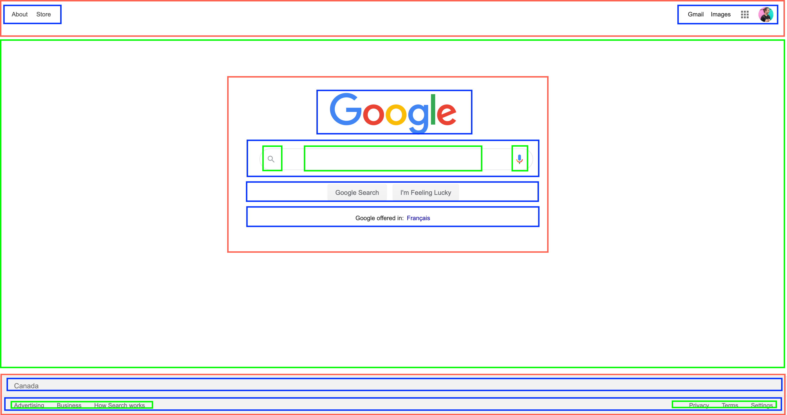

Woah that's a lot! Let's break it down a bit more.

I find it easiest to break out all of the horizontal groups so that I can think in `<div>`'s since that is how they naturally flow.

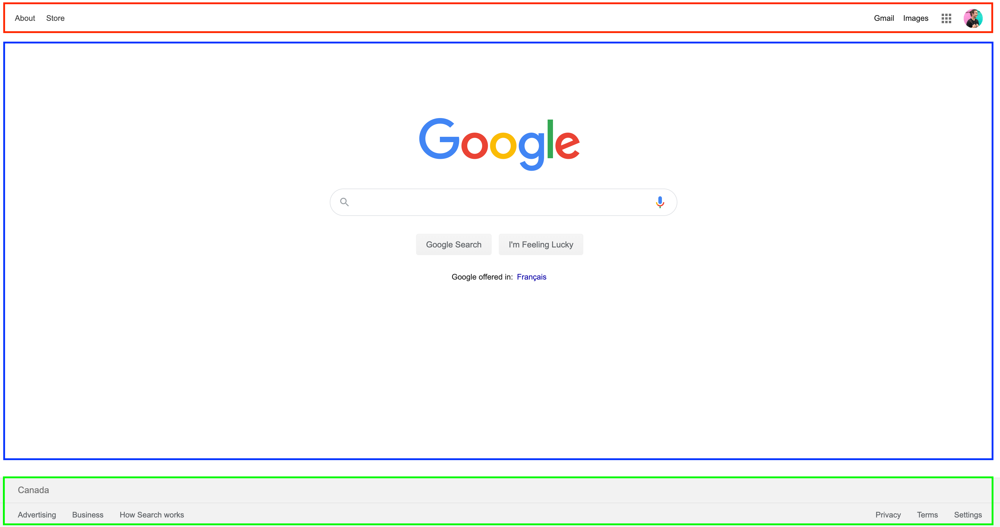

Here we've identified 3 main groups:

1. The navigation, red, will be a `<nav>` element
2. The main content, blue, will be a `<main>` element
3. The footer, green, will be a `<footer>` element

Let's look at what the `<nav>` will be composed of


We can identify a few things:

1. The red would be our outter `<nav>` element
2. The blue would each be a `<div>` inside, each with a list of elements of their own

We can achieve this effect quite easily with flexbox! When we want two things to be spaced on either side, we can use a flex row with the `justify-content` property set to `space-between`

```html
<html>
  <head>
    <style>
      nav {
        display: flex;
        justify-content: space-between;
      }
    </style>
  </head>
  <body>
    <nav>
      <div>
        <a href="#">About</a>
        <a href="#">Store</a>
      </div>
      <div>
        <a href="#">Gmail</a>
        <a href="#">Images</a>
        
        
      </div>
    </nav>
  </body>
</html>
```

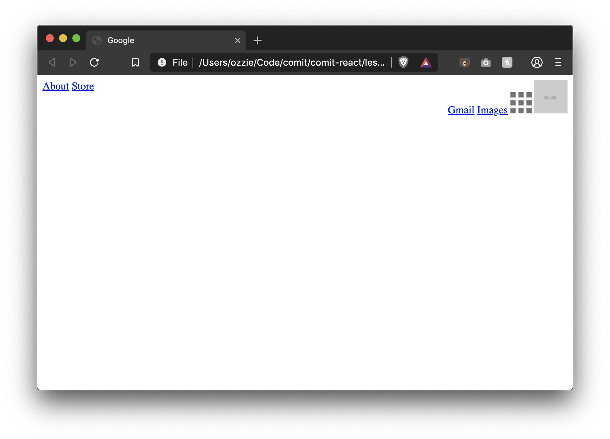

Awesome! Our nav items are on their respective sides, but they arent aligned vertically (pictured below).

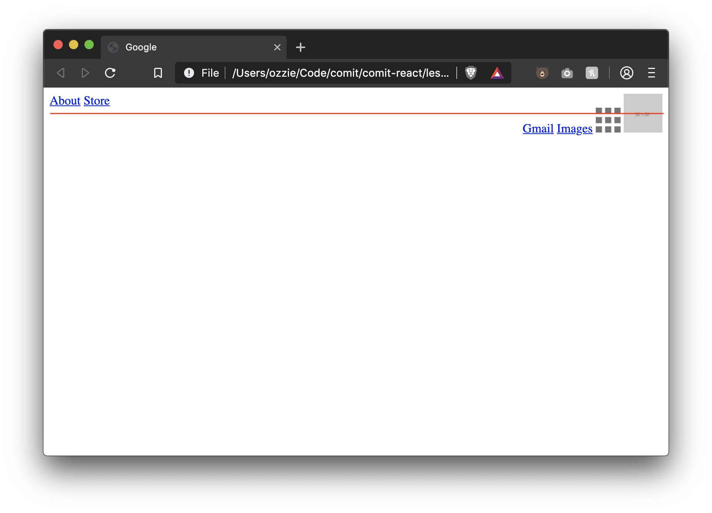

To fix this, we can tell flex box to vertically align our two divs by using the `align-items` property.

```diff
<html>
  <head>
    <style>
      nav {
        display: flex;
        justify-content: space-between;
+       align-items: center;
      }
    </style>
  </head>
  <body>
    <nav>
      <div>
        <a href="#">About</a>
        <a href="#">Store</a>
      </div>
      <div>
        <a href="#">Gmail</a>
        <a href="#">Images</a>
        
        
      </div>
    </nav>
  </body>
</html>
```

This will place the two divs aligned in the center, pictured below

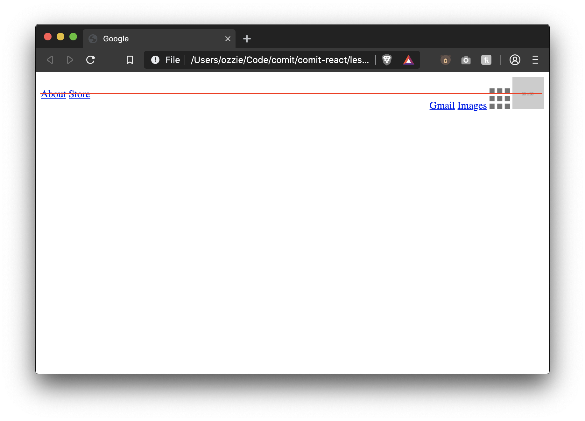

But now we notice that the right content of our nav isn't aligned vertically in the center. We'll solve this just like we did above, using flexbox!

We can add `display: flex` to a child of a flexbox element, in this case the `div` inside of our `nav`. We'll also tell it to use `align-items: center` to align its children vertically.

```diff
<html>
  <head>
    <style>
      nav {
        display: flex;
        justify-content: space-between;
        align-items: center;
      }
+     .nav-right {
+       display: flex;
+       align-items: center;
+     }
    </style>
  </head>
  <body>
    <nav>
      <div>
        <a href="#">About</a>
        <a href="#">Store</a>
      </div>
+     <div class="nav-right">
        <a href="#">Gmail</a>
        <a href="#">Images</a>
        
        
      </div>
    </nav>
  </body>
</html>
```

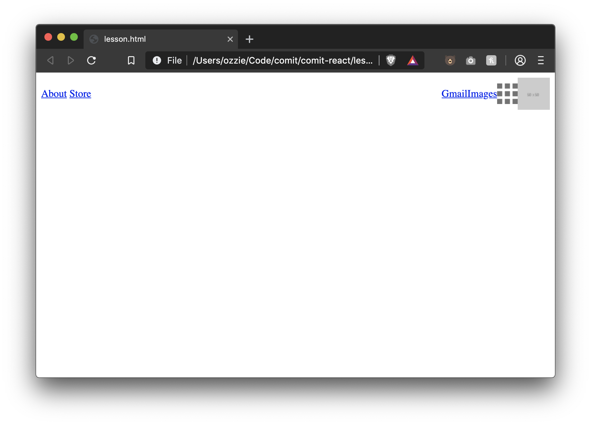

Much better! Now we just need to give the navigation items some breathing room. Let's add a margin to every link and image inside the nav to give some space. We'll also add some left and right padding to the nav itself to pull it off the sides of the page a bit.

While we're at it, let's make the links black like Google too.

```diff
<html>
  <head>
    <style>
      nav {
        display: flex;
        justify-content: space-between;
        align-items: center;
+       padding-left: 10px;
+       padding-right: 10px;
      }
+     .nav-right {
+       display: flex;
+       align-items: center;
+     }
+     nav a,
+     nav img {
+       margin-right: 15px;
+     }
+     nav a {
+       color: #333;
+       text-decoration: none;
+     }
+     nav a:hover {
+       text-decoration: underline;
+     }
    </style>
  </head>
  <body>
    <nav>
      <div>
        <a href="#">About</a>
        <a href="#">Store</a>
      </div>
     <div class="nav-right">
        <a href="#">Gmail</a>
        <a href="#">Images</a>
        
        
      </div>
    </nav>
  </body>
</html>
```

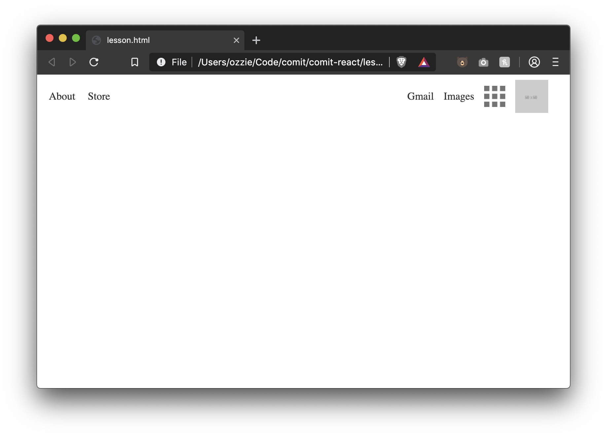

Looking good! Let's move on to the main content section.

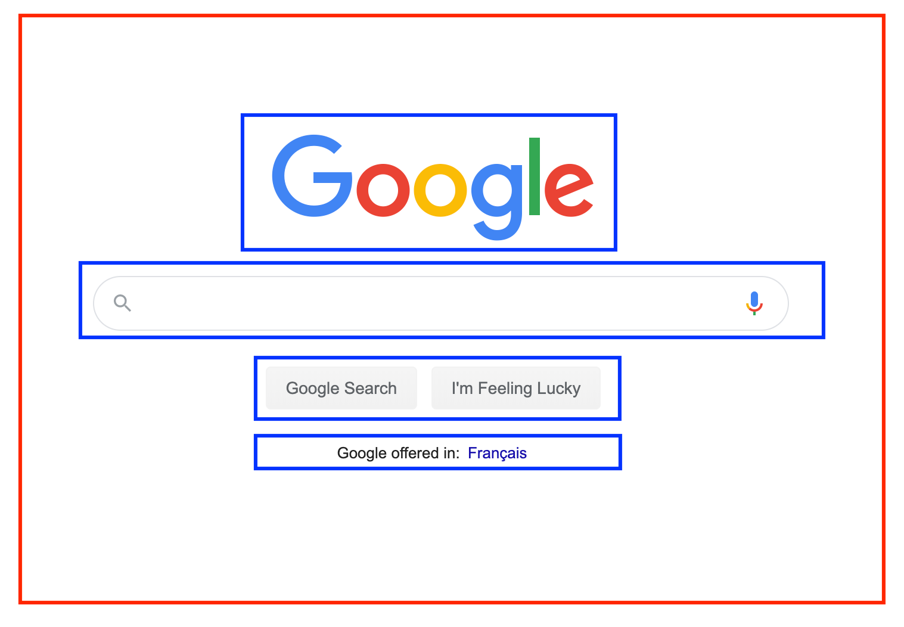

There's probably going to be four parts to this main section.

- The `<main>` tag container
  - Google's logo inside
  - A search `<input />`
  - Two buttons
  - A paragraph with a link

And we're going to use flexbox for all of them!

Let's start with the `<main>` tag and the logo. If we refer to the image above, we can see that everything is centered and in a column instead of a row. So let's place the img inside of the main tag, give the main tag a display of flex, set it's flex-direction to column, and center the content horizontally.

Remember, when we set the `flex-direction: column` to horizontally align you must use `align-items` instead of `justify-content`.

The image will also be a bit big, so let's set the width to `150px`.

```diff
<html>
  <head>
    <style>
      nav {
        display: flex;
        justify-content: space-between;
        align-items: center;
        padding-left: 10px;
        padding-right: 10px;
      }
      .nav-right {
        display: flex;
        align-items: center;
      }
      nav a,
      nav img {
        margin-right: 15px;
      }
      nav a {
        color: #333;
        text-decoration: none;
      }
      nav a:hover {
        text-decoration: underline;
      }
+     main {
+       display: flex;
+       flex-direction: column;
+       align-items: center;
+     }
+     .google-logo {
+       width: 150px;
+     }
    </style>
  </head>
  <body>
    <nav>
      <div>
        <a href="#">About</a>
        <a href="#">Store</a>
      </div>
      <div class="nav-right">
        <a href="#">Gmail</a>
        <a href="#">Images</a>
        
        
      </div>
    </nav>
+   <main>
+     
+   </main>
  </body>
</html>
```


Awesome! Next up is that search input. Let's also break this one down into more pieces:

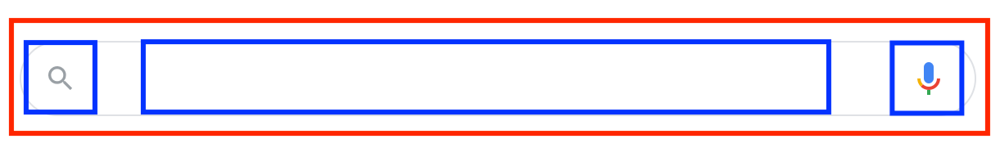

Here I see 4 things

- A container `<div>` that will hold 3 things
  - The magnifying glass image
  - An input (without borders)
  - An image for the voice dictation

Let's add those right underneath our image, inside a form

```diff
<html>
  <head>
    <style>
      nav {
        display: flex;
        justify-content: space-between;
        align-items: center;
        padding-left: 10px;
        padding-right: 10px;
      }
      .nav-right {
        display: flex;
        align-items: center;
      }
      nav a,
      nav img {
        margin-right: 15px;
      }
      nav a {
        color: #333;
        text-decoration: none;
      }
      nav a:hover {
        text-decoration: underline;
      }
      main {
        display: flex;
        flex-direction: column;
        align-items: center;
      }
      .google-logo {
        width: 150px;
      }
    </style>
  </head>
  <body>
    <nav>
      <div>
        <a href="#">About</a>
        <a href="#">Store</a>
      </div>
      <div class="nav-right">
        <a href="#">Gmail</a>
        <a href="#">Images</a>
        
        
      </div>
    </nav>

    <main>
      

+     <form>
+       <div>
+         
+         <input type="text" />
+         
+       </div>
+     </form>
    </main>
  </body>
</html>
```

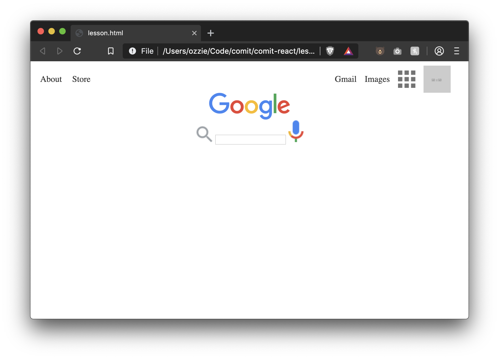

I hope you're starting to see a pattern here. Our search elements are out of line, so let's use flexbox to fix them. We'll also shrink the images inside the container as well.

```diff
<html>
  <head>
    <style>
      nav {
        display: flex;
        justify-content: space-between;
        align-items: center;
        padding-left: 10px;
        padding-right: 10px;
      }
      .nav-right {
        display: flex;
        align-items: center;
      }
      nav a,
      nav img {
        margin-right: 15px;
      }
      nav a {
        color: #333;
        text-decoration: none;
      }
      nav a:hover {
        text-decoration: underline;
      }
      main {
        display: flex;
        flex-direction: column;
        align-items: center;
      }
      .google-logo {
        width: 150px;
      }
+     .search-container {
+        display: flex;
+        align-items: center;
+      }
+     .search-container img {
+       width: 10px;
+       height: auto;
+     }
    </style>
  </head>
  <body>
    <nav>
      <div>
        <a href="#">About</a>
        <a href="#">Store</a>
      </div>
      <div class="nav-right">
        <a href="#">Gmail</a>
        <a href="#">Images</a>
        
        
      </div>
    </nav>

    <main>
      

      <form>
+       <div class="search-container">
          
          <input type="text" />
          
        </div>
      </form>
    </main>
  </body>
</html>
```


Great! Now let's just:

- add the border to the outside container (making sure to round it with `border-radius`),
- give some padding to the container so there is some breathing room
- push the input away from the icons a bit so they aren't touching
- increase the width of the input

```diff
<html>
  <head>
    <style>
      nav {
        display: flex;
        justify-content: space-between;
        align-items: center;
        padding-left: 10px;
        padding-right: 10px;
      }
      .nav-right {
        display: flex;
        align-items: center;
      }
      nav a,
      nav img {
        margin-right: 15px;
      }
      nav a {
        color: #333;
        text-decoration: none;
      }
      nav a:hover {
        text-decoration: underline;
      }
      main {
        display: flex;
        flex-direction: column;
        align-items: center;
      }
      .google-logo {
        width: 150px;
      }
      .search-container {
        display: flex;
        align-items: center;
+       border: 1px solid #dfe1e5;
+       border-radius: 25px;
+       padding: 10px;
      }
      .search-container img {
        width: 10px;
        height: auto;
      }
+     .search-container input {
+       margin-left: 10px;
+       margin-right: 10px;
+       width: 250px;
+     }
    </style>
  </head>
  <body>
    <nav>
      <div>
        <a href="#">About</a>
        <a href="#">Store</a>
      </div>
      <div class="nav-right">
        <a href="#">Gmail</a>
        <a href="#">Images</a>
        
        
      </div>
    </nav>

    <main>
      

      <form>
        <div class="search-container">
          
          <input type="text" />
          
        </div>
      </form>
    </main>
  </body>
</html>
```

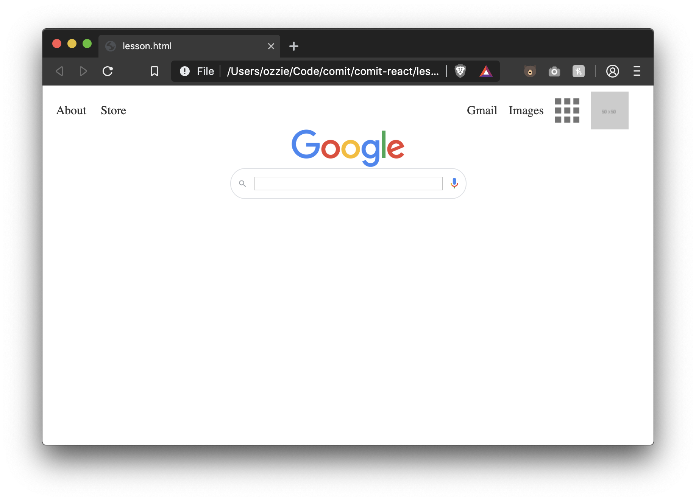

We're almost done this search box! Let's just remove the border from the input inside the container, and push the search box away from the logo a bit.

```diff
<html>
  <head>
    <style>
      nav {
        display: flex;
        justify-content: space-between;
        align-items: center;
        padding-left: 10px;
        padding-right: 10px;
      }
      .nav-right {
        display: flex;
        align-items: center;
      }
      nav a,
      nav img {
        margin-right: 15px;
      }
      nav a {
        color: #333;
        text-decoration: none;
      }
      nav a:hover {
        text-decoration: underline;
      }
      main {
        display: flex;
        flex-direction: column;
        align-items: center;
      }
      .google-logo {
        width: 150px;
      }
      .search-container {
        display: flex;
        align-items: center;
        border: 1px solid #dfe1e5;
        border-radius: 25px;
        padding: 10px;
+       margin-top: 20px;
      }
      .search-container img {
        width: 10px;
        height: auto;
      }
      .search-container input {
        margin-left: 10px;
        margin-right: 10px;
        width: 250px;
+       border: 0;
      }
    </style>
  </head>
  <body>
    <nav>
      <div>
        <a href="#">About</a>
        <a href="#">Store</a>
      </div>
      <div class="nav-right">
        <a href="#">Gmail</a>
        <a href="#">Images</a>
        
        
      </div>
    </nav>

    <main>
      

      <form>
        <div class="search-container">
          
          <input type="text" />
          
        </div>
      </form>
    </main>
  </body>
</html>
```

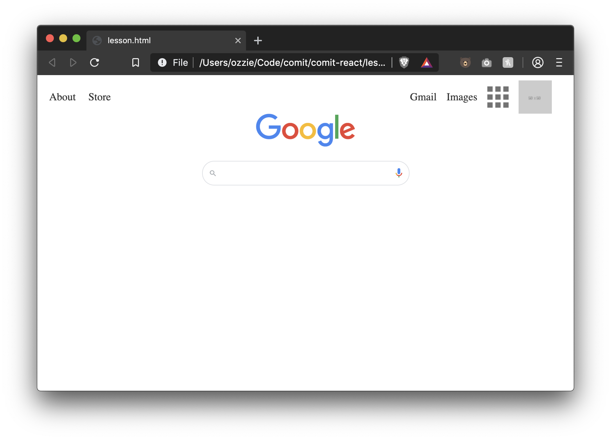

On to the buttons!

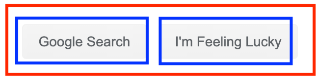

Again, a container with two items inside of it that need to be centered. Patterns!

Let's use flexbox again for the button's container, horizontally centering them using `justify-content: center`.

We'll also style the buttons inside the container using properties we've seen before.

We'll place these buttons inside the `<form>` tag but underneath the search box.

```diff
<html>
  <head>
    <style>
      nav {
        display: flex;
        justify-content: space-between;
        align-items: center;
        padding-left: 10px;
        padding-right: 10px;
      }
      .nav-right {
        display: flex;
        align-items: center;
      }
      nav a,
      nav img {
        margin-right: 15px;
      }
      nav a {
        color: #333;
        text-decoration: none;
      }
      nav a:hover {
        text-decoration: underline;
      }
      main {
        display: flex;
        flex-direction: column;
        align-items: center;
      }
      .google-logo {
        width: 150px;
      }
      .search-container {
        display: flex;
        align-items: center;
        border: 1px solid #dfe1e5;
        border-radius: 25px;
        padding: 10px;
        margin-top: 20px;
+       margin-bottom: 20px;
      }
      .search-container img {
        width: 10px;
        height: auto;
      }
      .search-container input {
        margin-left: 10px;
        margin-right: 10px;
        width: 250px;
        border: 0;
      }
+     .button-container {
+       display: flex;
+       justify-content: center;
+     }
+     .button-container button {
+       margin-right: 5px;
+       background: #f2f2f2;
+       color: #333;
+       border: 0;
+       border-radius: 3px;
+       padding: 8px 16px;
+     }
    </style>
  </head>
  <body>
    <nav>
      <div>
        <a href="#">About</a>
        <a href="#">Store</a>
      </div>
      <div class="nav-right">
        <a href="#">Gmail</a>
        <a href="#">Images</a>
        
        
      </div>
    </nav>

    <main>
      

      <form>
        <div class="search-container">
          
          <input type="text" />
          
        </div>

+       <div class="button-container">
+         <button>Google Search</button>
+         <button>I'm Feeling Lucky</button>
+       </div>
      </form>
    </main>
  </body>
</html>
```

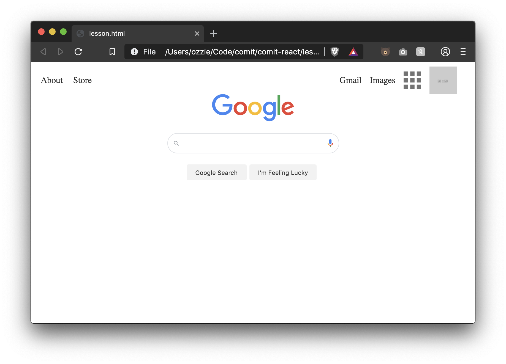

Awesome! Let's connect the form now to actually search Google.

```diff
<html>
  <head>
    <style>
      nav {
        display: flex;
        justify-content: space-between;
        align-items: center;
        padding-left: 10px;
        padding-right: 10px;
      }
      .nav-right {
        display: flex;
        align-items: center;
      }
      nav a,
      nav img {
        margin-right: 15px;
      }
      nav a {
        color: #333;
        text-decoration: none;
      }
      nav a:hover {
        text-decoration: underline;
      }
      main {
        display: flex;
        flex-direction: column;
        align-items: center;
      }
      .google-logo {
        width: 150px;
      }
      .search-container {
        display: flex;
        align-items: center;
        border: 1px solid #dfe1e5;
        border-radius: 25px;
        padding: 10px;
        margin-top: 20px;
        margin-bottom: 20px;
      }
      .search-container img {
        width: 10px;
        height: auto;
      }
      .search-container input {
        margin-left: 10px;
        margin-right: 10px;
        width: 250px;
        border: 0;
      }
      .button-container {
        display: flex;
        justify-content: center;
      }
      .button-container button {
        margin-right: 5px;
        background: #f2f2f2;
        color: #333;
        border: 0;
        border-radius: 3px;
        padding: 8px 16px;
      }
    </style>
  </head>
  <body>
    <nav>
      <div>
        <a href="#">About</a>
        <a href="#">Store</a>
      </div>
      <div class="nav-right">
        <a href="#">Gmail</a>
        <a href="#">Images</a>
        
        
      </div>
    </nav>

    <main>
      

+     <form action="https://google.ca/search" method="GET">
        <div class="search-container">
          
+         <input type="text" name="q" />
          
        </div>

        <div class="button-container">
          <button>Google Search</button>
          <button>I'm Feeling Lucky</button>
        </div>
      </form>
    </main>
  </body>
</html>
```

By setting the forms action to Google's `/search` page and the method to `GET`, we tell our browser that when this form is submitted to gather all of the NAMED inputs inside the form and to pass that along to the URL we specified in the `action` attribute.

It is also important that you set the input's `name` attribute to "q" as Google is expecting that exact name when it receives the search query.

Because we placed our buttons inside the `<form>` tag, when we click on either of them they will submit the form and perform the search! If they were outside of the form tags, the browser wouldn't know what to do with them.

One small change I'd like to make now, is that the font family is different to what Google used. Ours is defaulting to a serif font. Let's change the font-family for ALL elements using the universal selector `*`

```diff
<html>
  <head>
    <style>
+     * {
+       font-family: sans-serif;
+     }
      nav {
        display: flex;
        justify-content: space-between;
        align-items: center;
        padding-left: 10px;
        padding-right: 10px;
      }
      .nav-right {
        display: flex;
        align-items: center;
      }
      nav a,
      nav img {
        margin-right: 15px;
      }
      nav a {
        color: #333;
        text-decoration: none;
      }
      nav a:hover {
        text-decoration: underline;
      }
      main {
        display: flex;
        flex-direction: column;
        align-items: center;
      }
      .google-logo {
        width: 150px;
      }
      .search-container {
        display: flex;
        align-items: center;
        border: 1px solid #dfe1e5;
        border-radius: 25px;
        padding: 10px;
        margin-top: 20px;
        margin-bottom: 20px;
      }
      .search-container img {
        width: 10px;
        height: auto;
      }
      .search-container input {
        margin-left: 10px;
        margin-right: 10px;
        width: 250px;
        border: 0;
      }
      .button-container {
        display: flex;
        justify-content: center;
      }
      .button-container button {
        margin-right: 5px;
        background: #f2f2f2;
        color: #333;
        border: 0;
        border-radius: 3px;
        padding: 8px 16px;
      }
    </style>
  </head>
  <body>
    <nav>
      <div>
        <a href="#">About</a>
        <a href="#">Store</a>
      </div>
      <div class="nav-right">
        <a href="#">Gmail</a>
        <a href="#">Images</a>
        
        
      </div>
    </nav>

    <main>
      

      <form action="https://google.ca/search" method="GET">
        <div class="search-container">
          
          <input type="text" name="q" />
          
        </div>

        <div class="button-container">
          <button>Google Search</button>
          <button>I'm Feeling Lucky</button>
        </div>
      </form>
    </main>
  </body>
</html>
```

Much better!

Congrats! We've just recreated most of Google's home page. The exercise instructions below instruct you on how to complete the remaining steps.

# Exercise Instructions

We did 90% of the google.ca home page. See if you can:

- Add the footer
- Round the profile picture
- Shrink the menu image next to the profile picture to be the same size as the "Images" and "Gmail" text
- Add the language text underneath the buttons

# Exercise Results

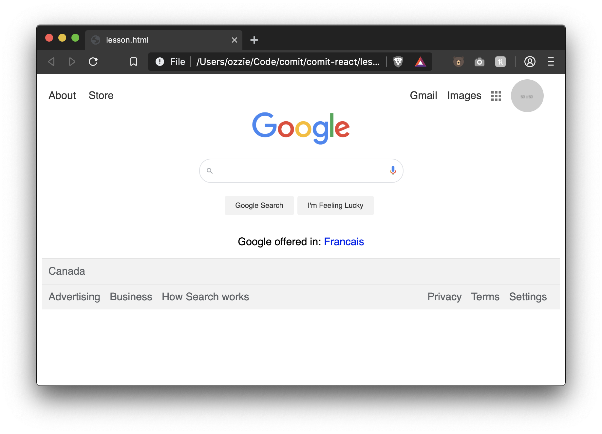

# Further Reading
