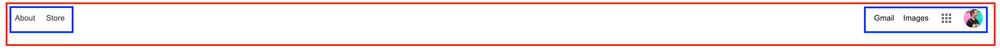

# Lesson 17 - Copying Google

# This lesson is incomplete, I will post the remaining later tonight

I find one of the best way to practice what we learn is to recreate what already exists! Unlike the last lesson where you had some creative freedom in what went on your website, this one we're going to recreate it exactly as it looks on [https://google.ca](https://google.ca). By doing this we do not need to spend time thinking or worrying about what needs to be done, since it's all layed out for us already!

Here's what we'll be building:


What I like to do before starting work is to break things out into sections so I know what groups I will need. I do this all mentally now, but let's look at what an image representation might look like:


Woah that's a lot! Let's break it down a bit more.

I find it easiest to break out all of the horizontal groups so that I can think in `<div>`'s since that is how they naturally flow.


Here we've identified 3 main groups:

1. The navigation, red, will be a `<nav>` element
2. The main content, blue, will be a `<main>` element
3. The footer, green, will be a `<footer>` element

Let's look at what the `<nav>` will be composed of



We can identify a few things:

1. The red would be our outter `<nav>` element
2. The blue would each be a `<div>` inside, each with a list of elements of their own

We can achieve this effect quite easily with flexbox! When we want two things to be spaced on either side, we can use a flex row with the `justify-content` property set to `space-between`

```html
<html>
  <head>
    <style>
      nav {
        display: flex;
        justify-content: space-between;
      }
    </style>
  </head>
  <body>
    <nav>
      <div>
        <a href="#">About</a>
        <a href="#">Store</a>
      </div>
      <div>
        <a href="#">Gmail</a>
        <a href="#">Images</a>
        
        
      </div>
    </nav>
  </body>
</html>
```

# Exercise Instructions

For this exercise we're going to recreate the google.com homepage!

# Exercise Results

# Further Reading
